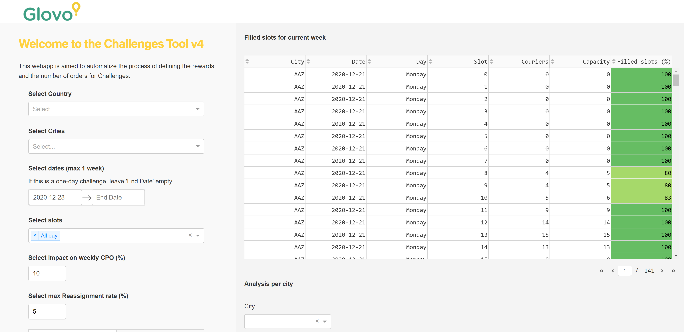

# Digit recognition

## About this app

This dashboard allows you to recognize digits (i.e., numbers from 0 to 9) manually drawn on your screen.

## Model

The Machine Learning model used to classify these digits is a Convolutional Neural Network trained on top of Inception v3.

## Data

The dataset used to train, validate and test the model, correpsond to the MNIST dataset. 

## Requirements

* Python 3

## How to run this app

We suggest you to create a virtual environment for running this app with Python 3. Clone this repository 
and open your terminal/command prompt in the root folder.

```
git clone https://github.com/....
cd /.../
python3 -m virtualenv venv

```
In Unix system:
```
source venv/bin/activate

```
In Windows: 

```
venv\Scripts\activate
```

Install all required packages by running:
```
pip install -r requirements.txt
```

Run this app locally with:
```
python app.py
```

## Screenshot



## Resources

* [Dash](https://dash.plot.ly/)
* Inspired by [Tableau template](https://www.tableau.com/solutions/workbook/improve-patient-satisfaction-improving-cycle-time).
