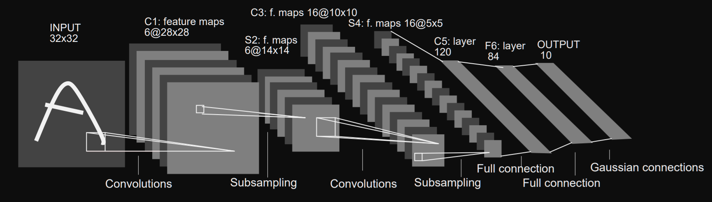

# Digit recognition

## About this app

This app allows you to recognize digits (i.e., numbers from 0 to 9) manually drawn on your screen.

## LeNet-5

Convolutional Neural Networks is the standard architecture of a neural network designed for solving tasks associated with images (e.g., image classification). Some of the well-known deep learning architectures for CNN are LeNet-5 (7 layers), GoogLeNet (22 layers), AlexNet (8 layers), VGG (16–19 layers), and ResNet (152 layers). 

For this project, we use LeNet-5, which has been successfully used on the MNIST dataset to identify handwritten-digit patterns. The LeNet-5 architecture is represented in the following image.



## Data

The dataset used to train, validate and test the model, correpsond to the [MNIST](http://yann.lecun.com/exdb/mnist/) dataset. 
It is composed by a training set of 60,000 examples, and a test set of 10,000 examples. 
The digits have been pre-processed to be size-normalized and centered in a fixed-size image of 28x28 pixels.


## Requirements

* Python 3
* Tensorflow
* Dash

## How to run this app

Clone this repository and navigate to the main folder:
```
git clone https://github.com/Guille1899/Digit_recognition.git
cd ./Digit_recognition/
```

I strongly suggest to create a virtual environment with conda to help manage dependencies and isolate projects. After installing [Anaconda](https://www.anaconda.com/products/individual), run the following commands to update the base Conda packages:
```
conda update conda
conda update python
conda update --all
```

Then, create the new conda environment called *digit_recognition* to store all the dependencies related with this repo:

```
conda create --name digit_recognition
conda activate digit_recognition
```

Install all required packages:
```
conda install --file requirements.txt
```

Time to install tensorflow. Note that if you have a NVIDIA graphics card on your machine, you should consider installing *tensorflow-gpu* to speed up your deep learning models. In any case, rather than using *pip* or *conda* to try to figure out which version of TensorFlow you need, I recommend finding the exact *.whl* file from [TensorFlow](https://www.tensorflow.org/install/pip#package-location)’s site.
Once you have the *url* of the corresponding TensorFlow version that you need, run the following command (substite *<whl_url>* by the exact url):
```
python -m pip install <whl_url>
```

Now, create a Jupyter Notebook kernel for the new environment:
```
conda install ipykernel jupyter
conda install -c conda-forge jupyter_nbextensions_configurator
python -m ipykernel install --user --name digit_recognition --display-name "digit_recognition-TF-GPU-2.4.0"
```

Open the jupyter notebook locally:
```
conda activate digit_recognition
jupyter notebook
```

Run the app locally:
```
conda activate digit_recognition
python app.py
```

## Screenshot


## Resources

* [Dash](https://dash.plot.ly/)
